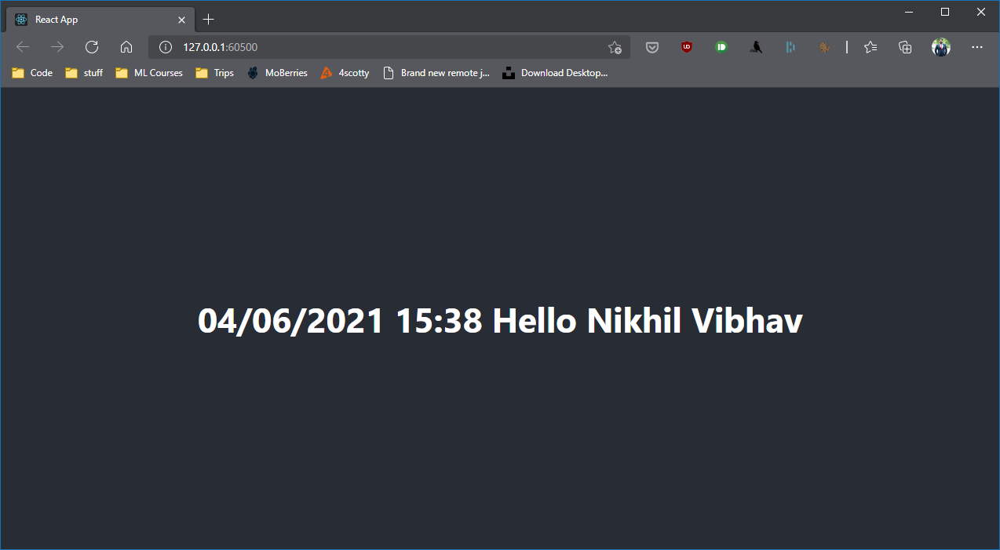

# Stakater Kubernetes Demo

This project has been structured as a single Git repository but with 2 different modules/directories for the frontend
and backend applications.

## Table of Contents

1. [Running with Minikube](#running-with-minikube)
2. [Minikube Backend](#minikube-backend)
3. [Minikube Frontend](#minikube-frontend)

## Running with Minikube

**Prerequisites**

1. Minikube
2. Docker
3. Kubernetes

Each directory contains its respective service's Dockerfile and Kubernetes' deployment file.

Before beginning, please do the following:

1. Start minikube: `minikube start --driver=docker`
2. Configure minikube to use the in cluster docker daemon for images: `eval $(minikube docker-env)` (on Unix based
   systems) and `minikube docker-env | Invoke-Expression` (in Powershell on Windows)
3. Now when you build an image with `docker build ...` it will be instantly accessible to the kubernetes cluster on your
   local machine. More information here [Pushing Images | minikube](https://minikube.sigs.k8s.io/docs/handbook/pushing/)

**NOTE 1:** Evaluating the docker-env is only valid for the current terminal. By closing the terminal, you will go back
to using your own system’s docker daemon

**NOTE 2:** In container-based drivers such as Docker or Podman, you will need to re-do docker-env each time you restart
your minikube cluster

### Build and deploy `minikube-backend` to the Kubernetes cluster

- `cd` into the `minikube-backend` directory
- Run the docker build:  `docker build -t stakater/minikube-backend .`
- Now you can deploy the minikube-backend service/deployment app into the kubernetes cluster by
  running: `kubectl apply -f deployment.yaml`

You should be able to see the pods, service and deployment created when you run `kubectl get all`

```bash
NAME                                    READY   STATUS        RESTARTS   AGE
pod/minikube-backend-76cc8c7bb9-n6wfh   1/1     Running       0          13s

NAME                       TYPE        CLUSTER-IP      EXTERNAL-IP   PORT(S)    AGE
service/kubernetes         ClusterIP   10.96.0.1       <none>        443/TCP    29m
service/minikube-backend   ClusterIP   10.110.108.27   <none>        8080/TCP   13s

NAME                               READY   UP-TO-DATE   AVAILABLE   AGE
deployment.apps/minikube-backend   1/1     1            1           13s

NAME                                          DESIRED   CURRENT   READY   AGE
replicaset.apps/minikube-backend-76cc8c7bb9   1         1         1       13s
```

### Build and deploy `minikube-frontend` to the Kubernetes cluster

- `cd` into the `minikube-frontend` directory
- Run the docker build:  `docker build -t stakater/minikube-frontend .`
- Now you can deploy the minikube-backend service/deployment app into the kubernetes cluster by
  running: `kubectl apply -f deployment.yaml`

You should be able to see the pods, service and deployment created when you run `kubectl get all`

```bash
NAME                                     READY   STATUS    RESTARTS   AGE
pod/minikube-backend-76cc8c7bb9-n6wfh    1/1     Running   0          3m10s
pod/minikube-frontend-7dd866969c-6fvld   1/1     Running   0          5s

NAME                        TYPE        CLUSTER-IP      EXTERNAL-IP   PORT(S)        AGE
service/kubernetes          ClusterIP   10.96.0.1       <none>        443/TCP        32m
service/minikube-backend    ClusterIP   10.110.108.27   <none>        8080/TCP       3m10s
service/minikube-frontend   NodePort    10.107.126.94   <none>        80:31000/TCP   5s

NAME                                READY   UP-TO-DATE   AVAILABLE   AGE
deployment.apps/minikube-backend    1/1     1            1           3m10s
deployment.apps/minikube-frontend   1/1     1            1           5s

NAME                                           DESIRED   CURRENT   READY   AGE
replicaset.apps/minikube-backend-76cc8c7bb9    1         1         1       3m10s
replicaset.apps/minikube-frontend-7dd866969c   1         1         1       5s
```

### Running the application

- Define the environment variable `NAME` in the [deployment file](minikube-backend/deployment.yaml) for minikube-backend
- Start both `minikube-backend` and `minikube-frontend` up and running in the kubernetes cluster in the steps described
  above
- To enable the frontend application to be able to communicate with the backend application,
  run: `kubectl port-forward service/minikube-backend 8080:8080` (This command does not return, so you will need to open
  a new terminal/window for the steps ahead)
- To run the frontend application: `minikube service minikube-frontend`, this will open up a new browser tab/window with
  the url where the service has been exposed on and you should see the following



Once you are done you can remove the services and apps from the cluster by
running `kubectl delete service,deployment minikube-backend minikube-frontend`

Finally, you can run `minikube stop` to close the kubernetes cluster

## minikube-backend

This is a simple Spring Boot app that exposes a `/api/v1/kubernetes-demo/greet` endpoint on port 8080 which returns "
Hello $NAME". e.g., if `$NAME` is **Stakater** then it returns "Hello Stakater".

### Build and Run

**Prerequisites**

1. Java 11
2. Gradle
3. Docker

You can build and run using Gradle or Docker:

**Gradle**

- `cd` into the `minikube-backend` directory
- `./gradlew clean build` will build the application
- `./gradlew bootRun --args='--NAME=Stakater'` will run the Spring Boot application

**Docker**

- `cd` into the `minikube-backend` directory
- Run `docker build -t stakater/minikube-backend .` (This will build, test and create a working container image)
- Verify if the image is available to docker by running `docker images`, you should see something like
    ```bash
    REPOSITORY                           TAG              IMAGE ID          CREATED             SIZE
    stakater/minikube-backend            latest           45c539b81e71      49 seconds ago      166MB
    ```
- Now you can run using `docker run -it -p8080:8080 -e NAME=Stakater stakater/minikube-backend`

Now once the application is running you can test it via curl

```bash
~ curl http://localhost:8080/api/v1/kubernetes-demo/greet
Hello Skatater
```

## minikube-frontend

**Note:** First time working with React, so please excuse any lack of tests and obvious errors that I might have made.

Simple app that calls the backend API's Greet endpoint and displays the response, prefixed by today's datetime in
dd/MM/yyyy HH:mm format. e.g., **04/06/2021 14:15 Hello Stakater**

### Build and Run

**Prerequisites**

1. NPM v7 or greater
2. To run, ideally you should have `minikube-backend` running. If it's not present the output on the React homepage
   would be incomplete

You can build and run using NPM or docker:

**NPM**

- `cd` into the `minikube-frontend` directory
- Run `npm start`, this should start the app and open the page http://localhost:3000 in your browser

**Docker**

- `cd` into the `minikube-frontend` directory
- Run `docker build -t nikhilvibhav/minikube-frontend .`
- Verify if the image is available to docker by running `docker images`, you should see something like
    ```bash
    REPOSITORY                           TAG              IMAGE ID          CREATED             SIZE
    stakater/minikube-frontend           latest           bf94830f034c      45 seconds ago      23.6MB
    ```
- Now you can run using `docker run -it -p3000:80 nikhilvibhav/minikube-frontend`

Now once the application is running you can test it via pointing your browser to http://localhost:3000, and it should
display the result **04/06/2021 14:15 Hello Stakater**
